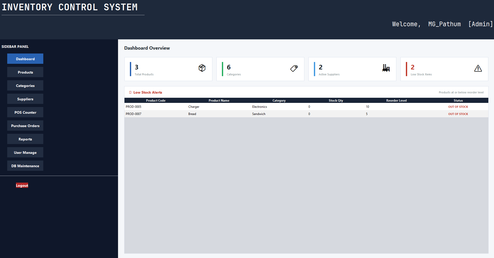
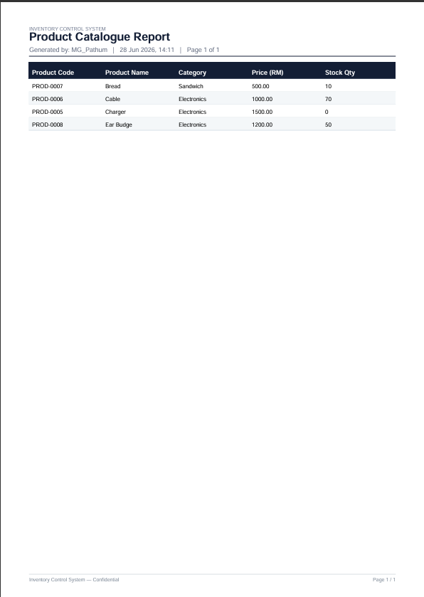

<div align="center">

# 🏪 Inventory Control System

### A full-featured Desktop POS & Inventory Management application built with Java Swing and MySQL.

Manage your entire retail operation from a single, clean interface — products, suppliers, sales, purchase orders, and business reports, all in one place.

<br/>


</div>

---

## 📋 Table of Contents

- [Overview](#-overview)
- [Screenshots](#-screenshots)
- [Key Features](#-key-features)
- [Tech Stack](#-tech-stack)
- [Architecture](#-architecture)
- [Project Structure](#-project-structure)
- [Prerequisites](#-prerequisites)
- [Installation & Setup](#-installation--setup)
- [Default Credentials](#-default-credentials)
- [Running the App](#-running-the-app)
- [License](#-license)
- [Author](#-author)

---

## 🔍 Overview

The **Inventory Control System** is a desktop-based Point of Sale and Inventory Management solution designed for small to medium retail businesses. Built as part of a university **Systems Analysis & Design (SAD)** assignment, the application demonstrates a complete, production-grade software architecture using the **MVC pattern**, a **DAO/Factory layer** for database abstraction, **bcrypt** password security, and automated business reporting with **JasperReports**.

The system handles the full retail workflow: user login → product & stock management → POS billing → purchase order tracking → report generation.

---

## 📸 Screenshots

| Login Screen | Dashboard |
|:---:|:---:|
|  |  |

| POS Counter | CRUD Operations |
|:---:|:---:|
|  |  |

| Reports | Database Schema |
|:---:|:---:|
|  |  |

---

## ✨ Key Features

### 🔐 Authentication & Security
- Secure login with **bcrypt**-hashed passwords (jBCrypt)
- Role-based access control for admin and cashier users
- Account activation/deactivation by the administrator
- Last-login timestamp tracking per user

### 📦 Product & Inventory Management
- Full **CRUD** operations for products with auto-generated product codes (`PROD-XXXX` format)
- **Barcode generation** using Google ZXing (CODE-128 format), displayed live on screen
- Category-based product organisation
- Configurable **reorder level** with automatic low-stock alerts on the dashboard
- Product image support and soft-delete (deactivation without data loss)

### 🏷️ Category & Supplier Management
- Manage product categories with descriptions
- Full supplier directory with contact details
- Suppliers linked directly to purchase orders for traceability

### 🛒 POS Counter (Point of Sale)
- Fast, intuitive sales entry interface
- Add items by product code or search by name
- Real-time per-item discount percentage and tax calculation
- Automatic stock deduction on invoice finalisation
- Support for Walk-in and named customers
- Invoice voiding capability
- Auto-generated sequential invoice numbers

### 📋 Purchase Orders
- Record stock replenishment orders from suppliers
- Line-item breakdown per purchase order
- Tracks order status and links back to the supplier

### 📊 Reports & Exports
- Business reports powered by **JasperReports 6.21**
- Export to **PDF** (Apache PDFBox) and **Excel** (Apache POI)
- Sales reports filterable by date range
- Inventory and stock-level reports
- Purchase order history reports

### 🖥️ UI & Experience
- Modern **Nimbus Look & Feel** via Java Swing
- Consistent theming via a centralised `UITheme` class
- Responsive layout across screen sizes

### 📝 Logging
- Application-wide structured logging via **Apache Log4j 2**
- Configurable log levels and output targets via `log4j2.xml`

---

## 🛠️ Tech Stack

| Category | Technology | Version |
|---|---|---|
| **Language** | Java (OpenJDK) | 25 |
| **UI Framework** | Java Swing — Nimbus L&F | JDK built-in |
| **Build Tool** | Apache Maven | 3.9+ |
| **Database** | MySQL Server | 8.0+ |
| **DB Driver** | MySQL Connector/J (JDBC) | 8.3.0 |
| **Reporting Engine** | JasperReports | 6.21.3 |
| **PDF Export** | Apache PDFBox | 3.0.3 |
| **Excel Export** | Apache POI | 5.2.5 |
| **Barcode Generation** | Google ZXing | 3.5.3 |
| **Password Hashing** | jBCrypt | 0.4 |
| **Logging** | Apache Log4j 2 | 2.23.1 |
| **Testing** | JUnit 5 (Jupiter) | 5.10.2 |
| **IDE** | Apache NetBeans | 22+ |

---

## 🏗️ Architecture

The project follows a layered **MVC (Model-View-Controller)** architecture with a DAO abstraction layer, keeping each concern cleanly separated.

```
┌─────────────────────────────────────────┐
│              View Layer                 │
│   (Swing Frames & Panels — .java/.form) │
└────────────────────┬────────────────────┘
                     │ calls
┌────────────────────▼────────────────────┐
│           Controller Layer              │
│  (LoginController, ProductController,  │
│         SalesController, ...)           │
└────────────────────┬────────────────────┘
                     │ uses
┌────────────────────▼────────────────────┐
│         DAO Layer  (Interfaces)         │
│  UserDAO, ProductDAO, SalesInvoiceDAO,  │
│     PurchaseOrderDAO, SupplierDAO ...   │
└────────────────────┬────────────────────┘
                     │ implemented by
┌────────────────────▼────────────────────┐
│      DAO Implementations (JDBC)         │
│     dao/impl/*DAOImpl.java              │
└────────────────────┬────────────────────┘
                     │ via
┌────────────────────▼────────────────────┐
│   DatabaseConnection (Singleton)        │
│   + DAOFactory (Static Factory)         │
│         MySQL 8 Database                │
└─────────────────────────────────────────┘
```

---

## 📁 Project Structure

```
InventoryControlSystem/
│
├── 📄 pom.xml                          # Maven build & dependency configuration
├── 📄 README.md                        # Project documentation (you are here)
├── 📄 .gitignore                       # Git ignore rules for Java/Maven/NetBeans
│
├── 📂 Images/                          # Application screenshots
│
└── 📂 src/
    ├── 📂 main/
    │   ├── 📂 java/com/mycompany/inventorycontrolsystem/
    │   │   │
    │   │   ├── 📄 InventoryControlSystem.java   # ► Application entry point (main)
    │   │   │
    │   │   ├── 📂 model/               # Plain Java entity classes (POJO)
    │   │   │   ├── User.java
    │   │   │   ├── Product.java
    │   │   │   ├── Category.java
    │   │   │   ├── SalesInvoice.java
    │   │   │   ├── InvoiceItem.java
    │   │   │   ├── PurchaseOrder.java
    │   │   │   └── PurchaseOrderItem.java
    │   │   │
    │   │   ├── 📂 dao/                 # DAO interfaces (contracts)
    │   │   │   ├── UserDAO.java
    │   │   │   ├── ProductDAO.java
    │   │   │   ├── CategoryDAO.java
    │   │   │   ├── SupplierDAO.java
    │   │   │   ├── SalesInvoiceDAO.java
    │   │   │   ├── PurchaseOrderDAO.java
    │   │   │   └── impl/               # JDBC implementations
    │   │   │       ├── UserDAOImpl.java
    │   │   │       ├── ProductDAOImpl.java
    │   │   │       ├── CategoryDAOImpl.java
    │   │   │       ├── SupplierDAOImpl.java
    │   │   │       ├── SalesInvoiceDAOImpl.java
    │   │   │       └── PurchaseOrderDAOImpl.java
    │   │   │
    │   │   ├── 📂 db/                  # Database infrastructure
    │   │   │   ├── DatabaseConnection.java  # Thread-safe JDBC Singleton
    │   │   │   └── DAOFactory.java          # Static factory for all DAOs
    │   │   │
    │   │   ├── 📂 controller/          # Business logic layer
    │   │   │   ├── LoginController.java
    │   │   │   ├── ProductController.java
    │   │   │   └── SalesController.java
    │   │   │
    │   │   ├── 📂 view/                # Swing UI frames & panels
    │   │   │   ├── LoginFrame.java / .form
    │   │   │   ├── DashboardFrame.java / .form
    │   │   │   ├── ProductFrame.java / .form
    │   │   │   ├── CategoryFrame.java / .form
    │   │   │   ├── SupplierPanel.java / .form
    │   │   │   ├── POSPanel.java / .form
    │   │   │   ├── PurchaseOrderPanel.java / .form
    │   │   │   ├── ReportsPanel.java / .form
    │   │   │   └── UITheme.java             # Centralised colour & font constants
    │   │   │
    │   │   └── 📂 util/                # Shared utilities
    │   │       ├── BarcodeUtil.java         # ZXing barcode rendering helper
    │   │       └── PasswordUtil.java        # BCrypt hash/verify wrapper
    │   │
    │   └── 📂 resources/
    │       ├── 📄 database.properties       # ► DB credentials (edit before running)
    │       ├── 📄 log4j2.xml                # Log4j 2 logging configuration
    │       ├── 📄 update_admin_password.sql # One-time admin password fix script
    │       ├── 📂 images/                   # Embedded UI image assets
    │       └── 📂 reports/                  # JasperReports .jrxml / .jasper files
    │
    └── 📂 test/                         # JUnit 5 test classes
```

---

## ✅ Prerequisites

Make sure the following are installed before you begin:

| Tool | Version | Download |
|---|---|---|
| JDK (OpenJDK) | 25+ | [jdk.java.net](https://jdk.java.net/) |
| Apache Maven | 3.9+ | [maven.apache.org](https://maven.apache.org/download.cgi) |
| MySQL Server | 8.0+ | [dev.mysql.com](https://dev.mysql.com/downloads/mysql/) |
| Apache NetBeans *(recommended)* | 22+ | [netbeans.apache.org](https://netbeans.apache.org/) |
| Git | Latest | [git-scm.com](https://git-scm.com/) |

Verify your environment in a terminal:
```bash
java -version
mvn -version
mysql --version
```

---

## ⚙️ Installation & Setup

### Step 1 — Clone the Repository

```bash
git clone https://github.com/YOUR_USERNAME/Inventory-Control-System.git
cd Inventory-Control-System
```

---

### Step 2 — Create the MySQL Database

Open **MySQL Workbench** or the MySQL command-line client and run:

```sql
CREATE DATABASE inventory_db
  CHARACTER SET utf8mb4
  COLLATE utf8mb4_unicode_ci;
```

Then import the schema (if a `schema.sql` file is provided in the repo):

```bash
mysql -u root -p inventory_db < schema.sql
```

---

### Step 3 — Configure Database Credentials

Open the file:

```
src/main/resources/database.properties
```

Update it with your local MySQL credentials:

```properties
db.driver=com.mysql.cj.jdbc.Driver
db.url=jdbc:mysql://localhost:3306/inventory_db?useSSL=false&serverTimezone=Asia/Kuala_Lumpur&allowPublicKeyRetrieval=true
db.username=root
db.password=YOUR_MYSQL_PASSWORD
```

> ⚠️ **Security note:** Never commit real credentials to a public repository. Add `database.properties` to `.gitignore` for production use, and use environment variables or a secrets manager instead.

---

### Step 4 — Fix the Admin Password (One-Time Setup)

The application uses **BCrypt** for password hashing, which is incompatible with plain SHA-256 hashes that may be in the schema seed. Run the included utility to generate the correct hash:

1. In **NetBeans**: right-click `PasswordHashGenerator.java` → **Run File**
2. It will print a ready-to-run SQL `UPDATE` statement in the output window
3. Copy that statement and run it in MySQL Workbench:

```sql
USE inventory_db;
UPDATE users
SET    password_hash = '$2a$12$PASTE_THE_PRINTED_HASH_HERE'
WHERE  username = 'admin';
```

The hash will start with `$2a$12$` — that confirms it's the correct BCrypt format.

---

### Step 5 — Build the Project

```bash
mvn clean install
```

Maven will download all dependencies automatically on first run. A successful build outputs:

```
[INFO] BUILD SUCCESS
```

---

## ▶️ Running the App

**Option A — Maven (any terminal):**

```bash
mvn exec:java
```

**Option B — NetBeans IDE:**

Open the project folder in NetBeans (`File → Open Project`) and press **F6** or click the green **Run** button.

**Option C — Executable JAR (after build):**

```bash
java -jar target/InventoryControlSystem-1.0-SNAPSHOT-jar-with-dependencies.jar
```

---

## 🔑 Default Credentials

| Field | Value |
|---|---|
| Username | `admin` |
| Password | `admin123` |

> Change the password immediately after your first login for any non-development environment.

---

## 📜 License

This project is open source and available under the [MIT License](LICENSE).

```
MIT License — Copyright (c) 2025

Permission is hereby granted, free of charge, to any person obtaining a copy
of this software to use, copy, modify, merge, publish, distribute, sublicense,
and/or sell copies of the Software, subject to the conditions in the full
LICENSE file.
```

---

## 👤 Author

<div align="center">

**[Your Name]**

*Systems Analysis & Design (SAD) — University Assignment, 2025*

[](https://github.com/yourusername)
[](https://linkedin.com/in/yourprofile)

---

*If you found this project useful, consider giving it a ⭐ on GitHub!*

</div>
